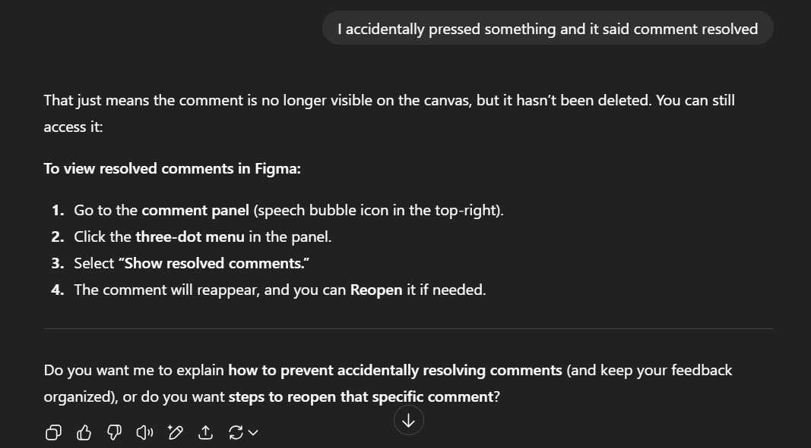

# Use of AI Tools

## What AI tools are typically used for your role?
- Figma with AI plugins
- Uizard
- Attention Insight
- Khroma
- Jasper
- ChatGPT

## What are the benefits and risks of using AI in a professional setting?
### Benefits
- Increased efficiency and speed
- Informed and better decision making
- 24/7 Availability for help, suggestions, ideas

### Risks
- Sensitive company data can be leaked
- Over reliance that could limit employee capaclities
- Security vulnerabilities can lead to cyber attacks

## What types of information should never be entered into AI tools?
- Passwords
- Personal information
- Financial information
- Confidential company data
- Client data

## How can you fact-check and validate AI-generated content to ensure accuracy?
- Double check with trusted resources
- Ask for references and verify
- Use multiple tools to check for consistency

## When should you use AI for assistance, and when should you rely on your own skills?
I should make an effort to use AI for assistance only after I have made considerable effort to solve the issue. If i cannot figure it out myself even after asking my peers or supervisor, I should use AI. For tasks consisting sensitive data, I should completely rely on my own skills.

## How can you avoid over-reliance on AI while still benefiting from it?
I can use it as a supportive tool to assist me in tasks rather than relying on it to complete my task fully with it having the final decision.

## What steps will you take to ensure data privacy when using AI tools?
- I will avoid enterring sensitive information
- Before enterring my prompt, I will read everything to ensure sensitive data is not included
- I will only use temporary chats so that no data is remembered.

## Identify one task you can improve using an AI tool, and try it out.

- While creating a low-fidelity wireframe for one of my other tasks, I accidentally resolved one of my own comments and wasn't sure how to get them back. So I asked ChatGPT to help me get them back. I've attached a screenshot below:

- This prompt provided an easy to follow answer that helped me unresolve it.

## Review the AI-generated output critically—did it require editing or fact-checking?

- It didn't require editing but for fact-checking I was able to automatically do it as I followed along with the steps and it was exactly right. It perfectly described how to reopen the comment with descriptions of where I can find the relevant options such as the comment panel.

## Document one best practice you will follow when using AI tools at Focus Bear.
I will ensure to be very careful when writing prompts to not include any sensitive data.
