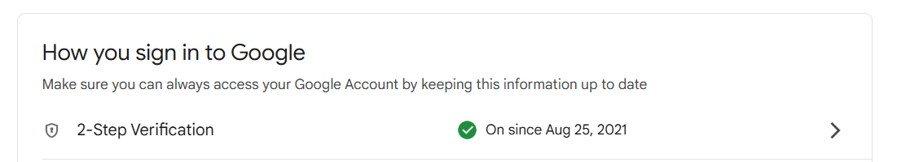
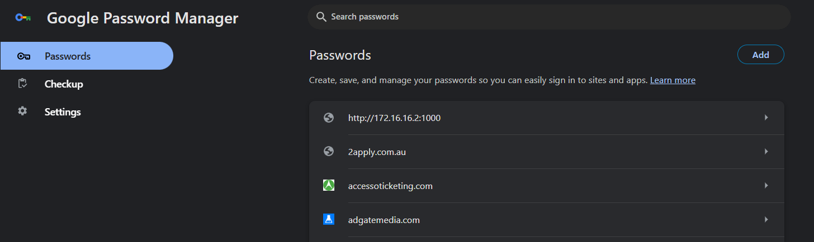

# Cyber Security Guidelines

## What are common cyber security threats in a remote work environment?
- Phishing attacks via emails
- Data breaches
- Malware and Ransomware attacks
- Denial of Service attacks
- Account compromisation

## What are best practices for keeping your devices and accounts secure?
- Have strong passwords with 2 factor authentication
- Use a strong antivirus
- Use a firewall
- Encrypt data
- Backup data regularly

## Why is it important to lock your computer when away from your desk?
So that someone unauthorised can not access sensitive company data and other vital information.

## How should you handle phishing attempts and suspicious links?
Avoid clicking suspicious emails and links. Contact the IT team to verify that the email is legitimate. If not, report it and delete the email.

## What makes a strong password, and why should you use a password manager?
A combination of lower and upper case characters, numbers, special characters all combined make a very strong password. It is important to use a trusted password manager so that you dont have to type in the password everytime you want to login and it helps protect you from phishing attacks as the password gets automatically filled only on the correct website.

## Why is two-factor authentication (2FA) important, and when should you enable it?
It strengthens online security by adding an extra layer of security by requiring two forms of verification before getting access. This verifies that the authorised person is trying to sign in and helps prevent unauthorised access even if the password is compromised. It should be enabled wherever possible especially on accounts containing sensitive or work-related information.

## What security measures do you currently follow, and where can you improve?
I have enabled 2 factor authentication for a lot of websites and have strong unique passwords with a password manager. I can improve by regularly reviewing my security settings to ensure all my accounts are safe with the best security.

## How can you make secure behaviour a habit rather than an afterthought?
I can train myself to make secure behaviour a daily habit by being mindful every time I sign in to accounts or handle sensitive information. It’s always safer to be over-protective rather than careless, so I will make it a routine to verify links before clicking, double-check unusual requests, and stay alert to potential security risks in my daily workflow.

## What steps will you take to ensure your passwords and accounts are secure?
I will always have strong unique passwords so if one password is exposed, it wont affect my other accounts. I will also have all my passwords in a password manager so I dont have to rely on memory.

## What would you do if you suspected a security breach or suspicious activity on your account?
I would immediately change my password to a strong, completely different password and ensure 2FA is set up. I would also report the issue to my IT team to ensure it is investigated and to reduce the risk of data breaches.

## Ensure your work accounts have strong passwords and enable 2FA where possible.

- I have attached below a screenshot of my work account having 2FA enabled.

- 

## Review your password storage method—if you’re not using a password manager, consider setting one up.

- I have attached below a screenshot of my work account having Google Password Manager manage my passwords for some accounts.

- 

## Document one new cyber security habit you will follow at Focus Bear.
I will make it a habit to lock my computer every time I step away from my desk, even if it’s just for a few minutes. I tend to avodi doing this but will ensure to make it a habit from today.