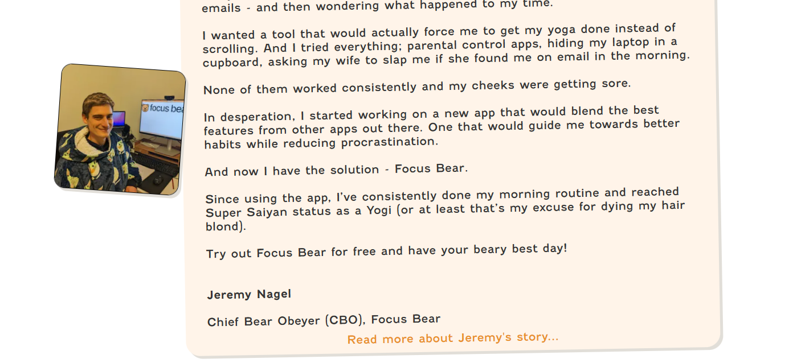

# Working with Vulnerable Populations

## Who are considered vulnerable populations, and what challenges might they face in digital spaces?
- Vulnerable populations include:
  - Neurodivergent individuals
  - People with disabilities
  - People with mental health conditions
  - Non-native language speakers
  - People who are in racial or ethnic minorities

- Challenges they may face:
  - Accessibility issues on websites
  - Overwhelm and cognitive load
  - Information overload
  - Emotional Toll

## What ethical considerations are important when designing or working with neurodivergent individuals?
- Avoid cognitive overload
- Speak respectfully and mindful
- Clear, direct communication
- Follow accessibility compliance

## How can you make interactions and content more accessible for people with ADHD or Autism?
- Use simple language
- Ensure predictable and intuitive navigation
- Allow customisation
- Ensure software follows the WCAG accessibility guidelines
- Support autonomy

## How can we support neurodivergent team members in a professional setting?
- Clear communication
- Respect work styles
- Have neurodiversity awareness training programs
- Have flexible work options

## How can you adjust your communication style to be more inclusive of neurodivergent users and teammates?
- Be Clear and Direct
- Read their user manuals to understand how they prefer to be communicated with
- Use simple and plain language
- Structure information

## What are some common UX or communication pitfalls that might make Focus Bear less accessible or supportive?
- Overwhelming interface with too much elements and information.
- Development doesn't incorporate accessibility guideline suggestions.
- Forced interactions.
- Interfaces with annoying bugs.
- Inconsistent layouts.

## What is one practical change you can make in your work to better support vulnerable populations?
Adjust my communication style to be more clear, direct, and structured so that there isn't too much different information communicated vaguely.

## Identify one design or communication improvement that could make Focus Bear more accessible
As I was going through the Focus Bear website. I came across a short section on Jeremy's Founder's note.

I then clicked the the "Read mroe about Jeremy's story..." link. It took me to this page

This confused me at first because I thought this was an incorrect link. A small note that the "Share" text is not a link which can be confusing. But as I scrolled down and read through the text, I realised it was what I wanted to read about and how the saucepans were relevant to this link.

To avoid confusion, maybe include a title at the new page that shows that I was taken to the expected page and maybe not include the whole section of the initial part of the page to include the saucepan image and text.

## Practice writing a clear, patient, and supportive response to a hypothetical user struggling with executive functioning.
Hi [Name],

Thank you for reaching out! I really appreciate you sharing this. It’s completely okay to have days when things feel harder to manage, and you’re definitely not alone in this.

Focus Bear is here to support you, not pressure you. If you’d like, I can guide you through a few simple ways to adjust your settings to make things feel less overwhelming. For example, we can set up shorter sessions, fewer notifications, or more frequent breaks.

Please take things at your own pace. You’re doing your best, and that’s enough. Let me know if there’s anything specific you’d like help with, and I’ll be here to support you step by step.

You’ve got this!

Warm regards,

Ashaen