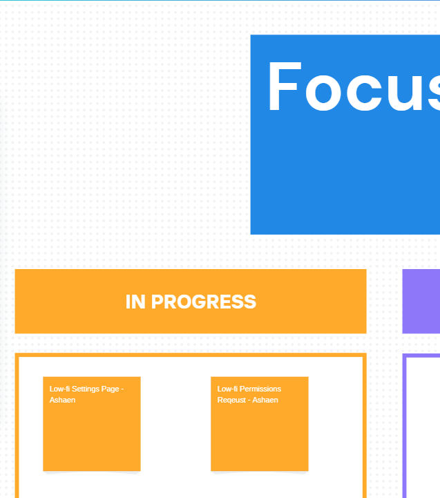
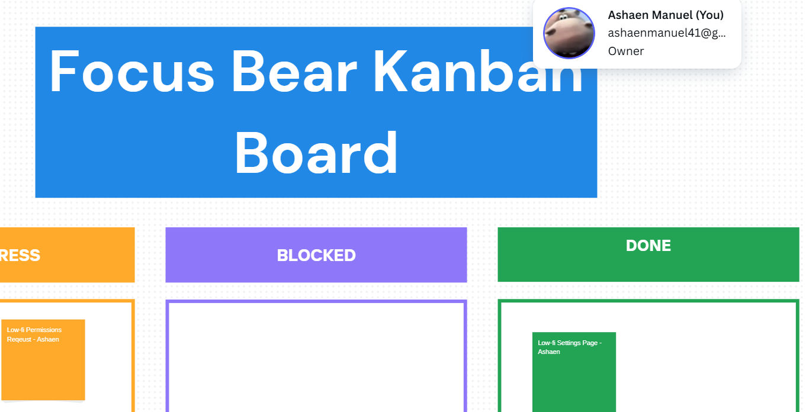

# Agile Workflows & Kanban

## How does a Kanban board work, and how does it help manage workflow?
It is a visual tool that helps manage and track work in progress.  It helps visualise the workflow, track progress, limit multitasking, highlight bottlenecks and supports async work.

## What do the different columns on a Kanban board represent?
- Backlog - Tasks that are planned but not yet started
- In progress - Tasks that are currrently being worked on 
- Blocked - Tasks that can't move forward due to an issue
- Done - Tasks that have been completed

## How do tasks move through the board, and who is responsible for updating them?
Tasks are moved from left to right through the columns as they progress and each team member is responsible for updating their own tasks.

## What are the benefits of limiting work in progress (WIP)?
- Improves focus
- Improves quality
- Reduces bottlenecks
- Enhances collaboration

## How does Kanban help manage priorities and avoid overload?
- Visualises workload
- Limits WIP
- Focuses on flow
- Makes priorities clear

## How can you improve your workflow using Kanban principles?
- I can visualise my workflow to improve it
- I can manage the flow of tasks making my work more efficient
- I can improve continously by adjusting my process based on what's working and not.

## Identify one way you can improve task tracking in your role.
I can use a Kanban board to break design work into smaller, clearly labeled tasks.

## Personal Reflection

Kanban boards lets me easily see an overview of all tasks that are in the backlog, in progress, blocked, and done. I've attached screenshots of moving one of my most recent tasks from the in-progress section to the done section.

When I moved the task on the Focus Bear board, I noticed how satisfying it was to see the progress visually represented. It made the completion feel more happy and also gave me clarity on what still needed my attention. One thing I found helpful was how the structure made it obvious when multiple tasks were piling up in “In Progress,” which was a signal to focus and finish rather than start something new.

Looking ahead, I can improve task tracking by consistently breaking larger pieces of work—like design iterations, testing feedback, into smaller tasks with clear labels. This will not only make it easier for me to see steady progress but also make collaboration smoother if I’m working with others.