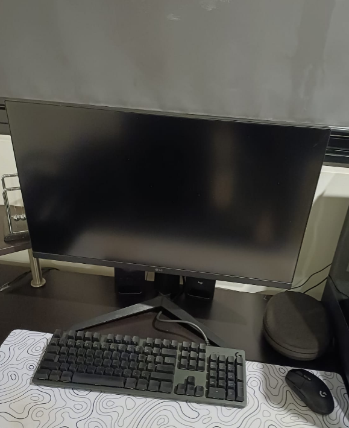

# Occupational Health & Safety (OHS) for Desk-Based Work

## What are the risks of using a laptop without an external monitor or keyboard?
- Poor posture
- Eye strain
- Wrist pain
- Less ergonomic

## What ergonomic equipment can improve posture when working on a laptop?
- Laptop stand
- External mouse and keyboard
- Ergonomic chair
- Footrest
- Adjustable desk

## What adjustments should be made to monitor height, chair position, and desk setup for a healthier workspace?
- Top of the screen should be eye level
- Screen should be arm's length away
- Feet flat on the floor
- Knees at 90 degree angle
- Lower back should be supported by the chair to sit straight
- Desk height should allow shoulders to be relaxed
- Wrists should be neutral

## What are some daily habits that reduce the impact of prolonged laptop use?
- Take frequent breaks by walking away fromm the laptop
- Do regular posture checks
- Blink often
- Hydrate regularly

## What equipment changes can you make to improve your workspace setup?
- Use a laptop stand
- Get an external keyboard
- Get an ergonomic chair

## What behavioural changes can you implement to improve posture and reduce strain?
- Sit upright
- Take regular breaks
- Adjust screen height to be at eye level
- Keep feet flat

## How can you remind yourself to maintain good posture and take breaks throughout the day?
- Use Focus Bear App or website to get break reminders
- Set scheduled reminders to stand up

## Identify at least one piece of equipment that could improve your posture and comfort.
A laptop stand could improve my posture because I am tall person and my screen is below my eye level than the average person.

## Document at least one workspace change or habit adjustment you made.
At home I have my PC which has an external keyboard and the whole set up is at my eye level.

I will use the Focus Bear app and website to remind me to take breaks. While working at home, I was on focus mode and I got a reminder to move around for 1 minute, I also got a similar reminder to do push ups. This is good for my eyes as well as my wellbeing
