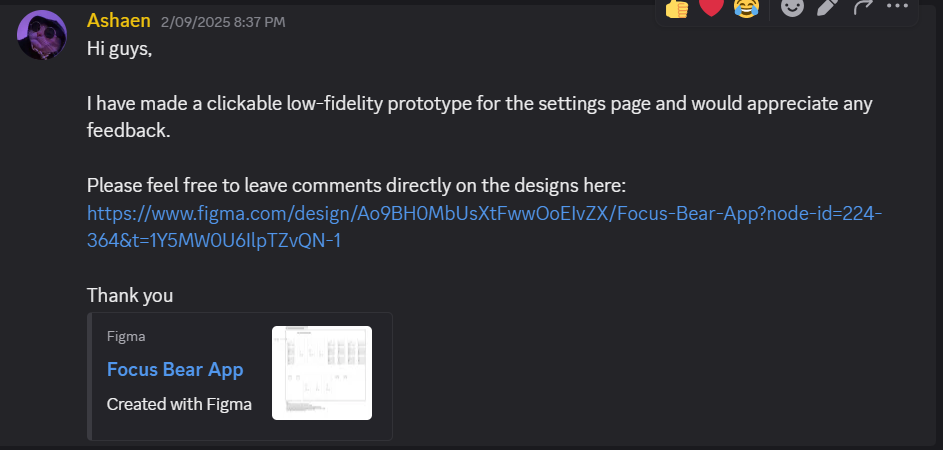
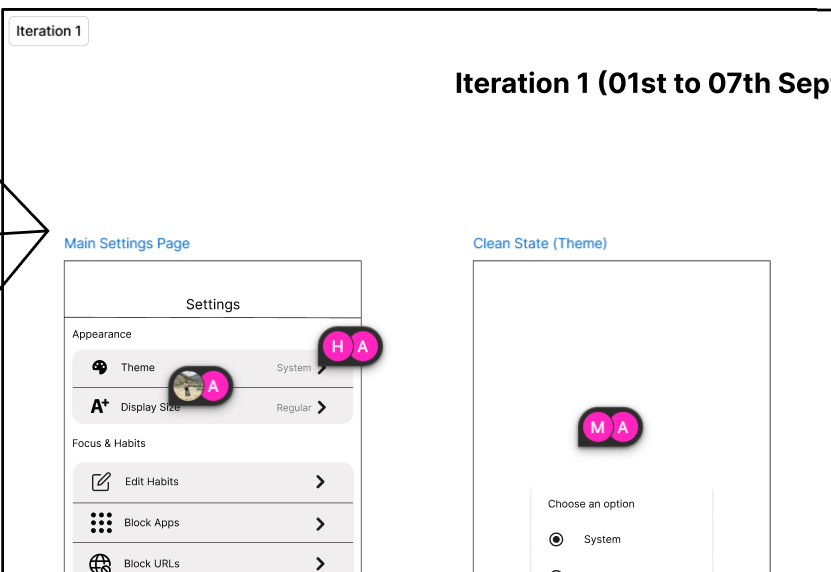
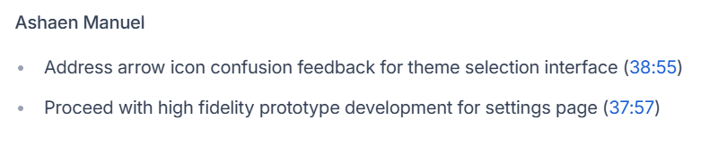

# Creating a Clickable Prototype in Figma  

## What is the difference between a static wireframe and an interactive prototype?  

**Static Wireframe**  
- Non-interactive: Just a set of fixed images or sketches showing layout and structure.  
- Focus: Visualizing content placement, hierarchy, and basic page elements.  
- Use: Early-stage planning, communicating design concepts, and gathering feedback on layout.  
- Example: A grayscale sketch showing where buttons, text, and images go, but you can’t click or navigate.  

**Interactive Prototype**  
- Interactive: Simulates user interactions like clicking buttons, navigating between screens, or filling forms.  
- Focus: Testing user flows, navigation, and overall experience.  
- Use: Usability testing, stakeholder demos, and refining the design before development.  
- Example: A clickable mockup where users can go through tasks as if using the real product.  

## How does prototyping help validate usability before development?  
- Simulates real user interactions.  
- Identifies usability issues early.  
- Validates user flows.  
- Gathers actionable feedback.  
- Reduces development risks.  
- Supports iterative design.  

## Key Features of Figma Prototyping Tools  
- Interactive hotspots.  
- Transitions and animations.  
- Device frames and scrolling.  
- Overlays and modals.  
- Interactive components.  
- Linking between frames.  
- Preview and sharing.  
- User flow mapping.  

## How do designers use prototypes for usability testing and stakeholder feedback?  

**Usability Testing**  
- Simulate user tasks.  
- Observe behavior.  
- Gather qualitative feedback.  
- Identify pain points early.  
- Test different versions.  

**Stakeholder Feedback**  
- Visualize concepts.  
- Demonstrate user flows.  
- Facilitate clear communication.  
- Incorporate suggestions.  
- Build confidence.  

## What usability issues can a clickable prototype reveal that a static wireframe cannot?  
- Navigation problems.  
- Interactive element clarity.  
- User flow efficiency.  
- Feedback and states.  
- Discoverability of features.  
- Timing and pacing.  
- Error handling.  
- Responsiveness.  

## How can prototyping help designers communicate ideas more clearly to developers?  
- Demonstrates functionality.  
- Clarifies user flows.  
- Highlights edge cases.  
- Shows animations and transitions.  
- Provides a shared reference.  
- Speeds up feedback loops.  
- Reduces assumptions.  

## Common Mistakes Designers Make When Creating Prototypes  
- Overcomplicating early prototypes.  
- Ignoring user goals.  
- Skipping key interactions.  
- Not testing with real users.  
- Using unrealistic content.  
- Neglecting accessibility.  
- Not updating prototypes after feedback.  
- Poor organization.  
- Relying solely on prototypes.  

---

## Task  

Using the low-fidelity wireframe I designed earlier that got approved by my supervisor, I moved on to designing a clickable prototype.  

**Figma Prototype Link:**  
[Focus Bear Clickable Prototype](https://www.figma.com/design/Ao9BH0MbUsXtFwwOoEIvZX/Focus-Bear-App?node-id=224-364&t=5wqn8UCyoPD5GJx9-0)  

---

## Feedback and Iteration  

I submitted my design on our **Discord group** requesting feedback:  
  

I received multiple comments on my Figma file as shown below:  
  

In our stand-up meeting, my supervisor approved the prototype and asked me to move on to a high-fidelity design:  
  

**Changes made based on feedback:**  
- Adjusted button placement for better accessibility.  
- Simplified navigation flow to reduce confusion.  
- Refined spacing and alignment based on supervisor suggestions.  

---

## Personal Reflection  

Working on this clickable prototype helped me see the difference between having a design on paper versus experiencing it interactively. I noticed that when I shared the prototype with the team, the feedback was much more concrete—people clicked through flows and quickly spotted where things felt unclear.  

The Discord feedback highlighted small details (like button placement and spacing) that I might not have caught otherwise. These were easy to fix at this stage, and I learned how prototyping uncovers practical usability issues that static designs can’t show.  

The supervisor’s approval in the stand-up confirmed I was on the right track and gave me confidence to move forward with a high-fidelity design. Going forward, I see prototyping not only as a validation tool but also as a way to communicate my ideas clearly with both developers and stakeholders.  

---
