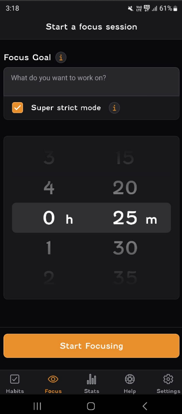

# Understanding of Focus Bear's mission and vision

## Why do you think Focus Bear was created?
Focus Bear was created to help people with ADHD, Autism, or other functioning challenges stay focused and productive. It supports users by limiting distractions, boosting motivation, and structuring daily tasks. It's not just for neurodivergent individuals, anyone who struggles with procrastination or staying on task can benefit. The app is designed to create a supportive, flexible environment that helps all users build better habits and get meaningful work done.

## What problem is Focus Bear solving?
- Helping people focus on work and remove their distractions
- Helping people start the day right
- Helping people eliminate decision fatigue

## Why do you think this mission is important?
This mission is important because it solves problems several people face day to day. Traditional tools usually don't support neurodivergent needs well so this app supports equity and accessiblity, helping everyone reach their potential.

## How does Focus Bear’s work align with your personal values or interests?
I enjoy developing unique and orignal apps that solve real problems and I believe Focus Bear does exactly this.

## Do you personally relate to any of the challenges that Focus Bear aims to solve?
Although I am not a neurodiveregent individual, I sometimes procrastinate on university assignments and end up rushing through them in the last minute. Hence, I believe that by using this App, it'll help me reduce my distractions and get productive work done daily. I personally find the "Super Strict Mode" of the Focus Bear App a really powerful feature for when I really can't afford to procrastinate on some work.

This, along with the normal focus mode will definetly help stay focused on completing my assignments in the coming weeks.