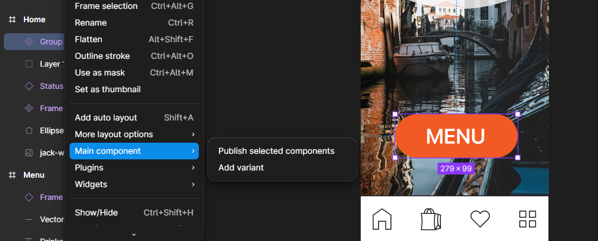
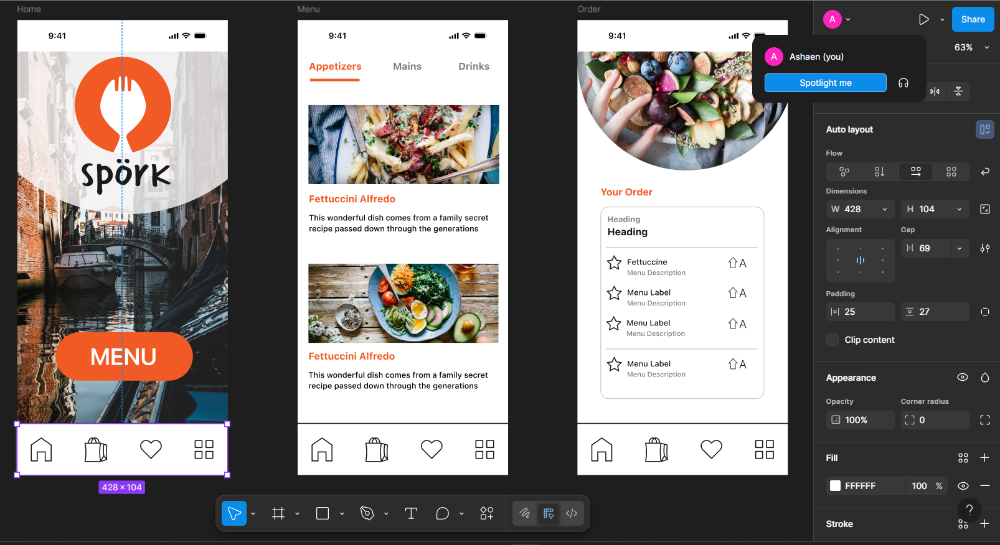

# Get Familiar with Figma for UI/UX Design

## What are the core features of Figma, and how is it different from other design tools?
Some core features of Figma include:
- Real time collaboration
- Cloud based
- Built-in Prototyping
- Design systems & component libraries
- Developer handoff with inspect tools
- Version history and auto save

What makes it unique:
- Works fully in the browser
- Multiple people can design at once
- Easier feedback and commenting
- Cross-platform
- Ideal for hybrid teams and agile workflows

## How does Figma support collaboration between designers, developers, and PMs?
- Real time editing where everyone can see what's happening
- Teams can leave comments directly anywhere on designs
- There are shareable links instead of having to download designs and share them
- Developers can view specs, CSS, and other assets.
- Design systems that keep components consistent across teams.
- Prototypes where PMs can test flows without needing a separate tool.

## What are components, variants, and auto-layout, and how do they improve design efficiency?
- Components
  - Components are elements we can reuse across our designs.
  - They help to create and manage consistent designs across projects.
  - When you update one of them once, the changes reflect everywhere.
  - The screenshot below shows a component button I've created:
  - 

- Variants
  - Variants allow us to group and organize similar components into a single container.
  - This simplifies our component library and makes it easier for everyone to find what they need.

- Auto-Layout
  - Auto layout can be used on frames so that designs will respond dynamically to content changes, saving us time and making our designs responsive and adaptable.

  - The screenshot below shows my recent project where I used auto-layout for the bottom navigation bar:

  - 

  - I learnt this feature through a LinkedIn course and was able to thoroughly understand it and realise how powerful a tool it is.

Together, they save time, ensure consistency, and simplify handoffs.

## How do you share and hand off designs to developers using Figma?
- Share a link with view or inspect access
- Mark exportable assets
- Use clear naming conventions for frames and components
- Add notes or comments for any design rationale or interactions.
- Maintain a design system or style guide in the file for consistency.

A useful link:
https://www.figma.com/best-practices/guide-to-developer-handoff/

## How would you organize a design system in Figma to ensure consistency?
- Create separate files for:
  - Colors
  - Typography
  - Icons
  - Components
- Use shared libraries so components stay synced across projects
- Group components using clear naming
- Use variants to manage states
- Document usage guidelines inside the file or in a linked doc
- Regularly audit and clean up to avoid duplicates or outdated elements

## If a developer needs details about a design component, how would you provide that using Figma?
- Share the figma link with inspect access
- Ensure the component is built with Auto Layout and named clearly
- Instruct them to use Inspect mode for:
  - Spacing
  - Fonts & colours
  - CSS values
- Mark assets for export
- Leave comments

## What challenges might arise when collaborating in Figma, and how can you avoid them?
- Version conflicts or overwriting
  - Avoidable by communicating changes and using branching or separate files for big updates.
- Poor file organisation leading to confusion
  - Avoidable by establishing clear naming conventions and folder structures
- Lack of feedback clarity
  - Avoidable by using precise comments tied to specific elements