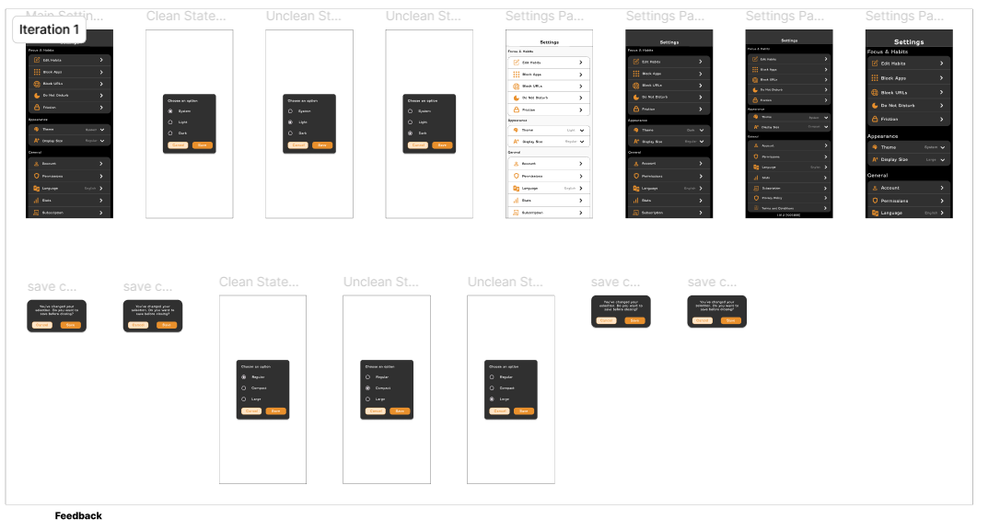
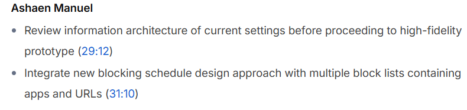
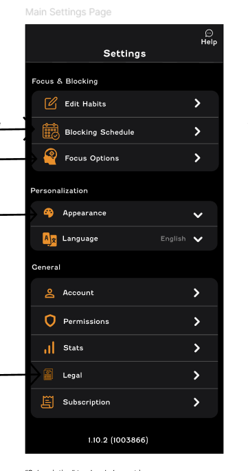
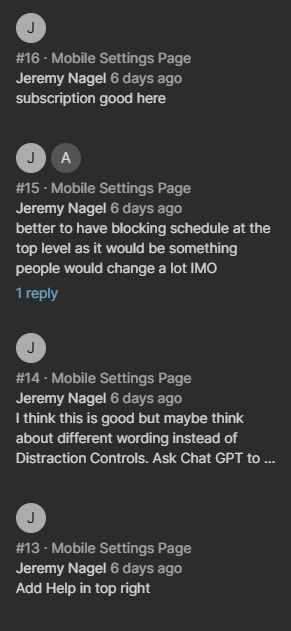
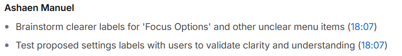

# Creating a High-Fidelity Prototype

## What’s the difference between a low-fidelity and high-fidelity prototype?

Low-Fidelity Prototype
- Simplicity: Basic, often grayscale layouts with simple shapes and placeholders.

- Interactivity: Limited—usually just basic navigation or key interactions.

- Purpose: Quickly test user flows, layout, and functionality early in the design process.

- Speed: Fast to create and easy to modify.

- Tools: Paper sketches, Balsamiq, simple digital wireframing tools.

High-Fidelity Prototype
- Detail: Closely resembles the final product with real colors, typography, images, and branding.

- Interactivity: Rich interactions including animations, transitions, and realistic behaviors.

- Purpose: Validate detailed design, visual style, and user experience before development.

- Speed: Takes more time and effort to build.

- Tools: Figma, Adobe XD, Sketch, Axure with advanced prototyping features.

## How do colors, typography, and spacing impact usability and accessibility?

Colors
- Usability: Help guide users’ attention, indicate hierarchy, and signal interactive elements (e.g., buttons, links).

- Accessibility: Must have sufficient contrast between text and background to be readable by users with visual impairments (e.g., color blindness). Avoid relying on color alone to convey meaning.

Typography
- Usability: Clear, legible fonts improve readability and reduce eye strain. Appropriate font sizes and weights help users scan and understand content quickly.

- Accessibility: Use fonts that support screen readers well. Avoid overly decorative or small fonts that hinder legibility, especially for users with low vision.

Spacing (Whitespace)
- Usability: Adequate spacing between lines, paragraphs, and interface elements reduces clutter, improves focus, and makes content easier to digest.

- Accessibility: Proper spacing supports users with cognitive disabilities by helping organize information clearly and prevents accidental clicks on touch targets.

## What are best practices for animations and micro-interactions in Figma?

1. Keep it subtle and purposeful
- Use animations to guide user attention or provide feedback—not just decoration. Avoid overwhelming or distracting effects.

2. Maintain consistency
- Use consistent animation styles (timing, easing, duration) across the product to create a cohesive experience.

3. Use appropriate easing
- Apply natural easing curves (like ease-in-out) to make animations feel smooth and organic.

4. Keep durations short
- Aim for 200–500 milliseconds for most micro-interactions to keep the interface feeling responsive.

5. Provide clear feedback
- Use micro-interactions to confirm user actions (e.g., button press, form submission) so users understand their input was recognized.

6. Test accessibility impact
- Ensure animations don’t cause motion sickness or distraction. Offer reduced motion alternatives when possible.

7. Prototype interactions accurately
- Use Figma’s Smart Animate to create smooth transitions between states and layers for realistic effects.

8. Limit complexity in prototypes
- Avoid overly complex animations that slow down prototype performance or confuse stakeholders.

9. Document animations
- Include notes on timing, easing, and triggers so developers can implement them correctly.

## How do UX designers ensure high-fidelity designs align with brand guidelines?

1. Use a Design System or Component Library
- Apply pre-approved UI components, colors, typography, and spacing directly from a shared design system.

- Tools like Figma can link to centralized libraries to maintain consistency across screens.

2. Follow Brand Style Guides
- Reference the official brand guidelines for logo usage, color palette, fonts, imagery, tone, and layout rules.

- Incorporate brand-specific elements (e.g., iconography, button styles) directly into designs.

3. Apply Consistent Visual Patterns
- Use consistent styling for headings, body text, forms, and buttons across all pages.

- Maintain uniform grid systems and spacing rules for visual alignment.

4. Collaborate with Visual Designers or Brand Teams
- Regular check-ins with brand or marketing teams help catch misalignments early.

- Review designs together to ensure visual and messaging consistency.

5. Use Tokens or Variables
- In tools like Figma or coded design systems, designers use variables (color, type, spacing tokens) to ensure brand-defined values are applied correctly.

6. Audit and QA High-Fidelity Designs
- Perform internal reviews or peer audits to check for brand compliance before handoff.

- Verify that colors, typography, imagery, and layout align with brand expectations.

7. Annotate for Developers
- Add notes or documentation to explain how elements follow brand standards, making it easier for developers to implement consistently.

## How can a high-fidelity prototype help developers build the final product accurately?

High-fidelity prototypes play a key role in bridging the gap between design and development. They closely resemble the final product in visual detail and behavior, which provides developers with a clear and accurate reference for implementation.

1. Visual Accuracy
- Provides exact specifications for layout, colors, typography, spacing, and imagery.
- Ensures developers don’t have to guess visual styles or rely on written descriptions alone.

2. Clear Interaction Behaviors
- Demonstrates animations, transitions, and micro-interactions (e.g., button states, form validation).
- Helps developers understand how elements should respond to user input.

3. Defined User Flows
- Shows how screens connect and how users move through the interface.
- Helps developers implement correct navigation and screen logic.

4. Component Reference
- Highlights reusable components and consistent patterns (e.g., buttons, cards, modals).
- Supports implementation of scalable, maintainable code using a design system.

5. Reduces Ambiguity
- Minimizes confusion around how features should look and behave.
- Prevents misinterpretation of static designs or written requirements.

6. Faster Handoff
- Can be accompanied by design specs and developer tools (e.g., Figma’s inspect panel) for pixel-perfect implementation.
- Allows developers to measure dimensions, export assets, and view CSS or code snippets directly.

7. Improves Collaboration
- Enables productive conversations between designers and developers.
- Acts as a shared source of truth throughout development.

## What are the risks of focusing too much on visuals before usability is validated?

1. Poor User Experience
- Visually polished designs may hide usability issues like confusing navigation or inefficient user flows.

- Users may struggle to complete tasks if the layout or interaction patterns aren’t intuitive.

2. Misguided Design Decisions
- Aesthetic appeal can give a false sense of completeness, leading teams to overlook functional flaws.

- Design choices may prioritize visual trends over actual user needs.

3. Increased Rework
- Major usability issues discovered late in the process may require redoing high-fidelity screens.

- Redesigning polished visuals is time-consuming and costly.

4. Inefficient Use of Resources
- Time and effort are spent refining colors, images, and animations that might later be scrapped or changed.

- Delays usability testing and user feedback, which are more critical in early stages.

5. Stakeholder Distraction
- Stakeholders may focus on visual details (e.g., fonts, colors) rather than giving meaningful feedback on user flows and task completion.

6. Developer Confusion
- Developers may build features based on beautiful designs that don’t actually solve usability problems.

- Can lead to building the “wrong thing” really well.

## How can small details like button states, hover effects, and transitions improve the user experience?

1. Provide Immediate Feedback
- Button states (e.g., default, hover, active, disabled) confirm user actions and system responsiveness.

- Example: A button that darkens slightly on click reassures the user that it registered the interaction.

2. Enhance Learnability
- Hover effects help users discover clickable areas or hidden functionality.

- Example: A tooltip or highlight on hover tells the user where to interact.

3. Improve Perceived Performance
- Transitions and animations can smooth out changes in the interface, making it feel faster and more intuitive.

- Example: A fade-in animation after loading keeps the experience visually pleasant and less abrupt.

4. Communicate Status or Affordances
- States like “loading,” “success,” or “error” indicate what’s happening or what will happen next.

- Example: A spinning loader inside a button tells the user that their action is processing.

5. Reinforce Brand Personality
- Subtle animations and transitions can make the interface feel polished and on-brand.

- Example: A playful bounce effect might suit a creative app, while smooth fades match a professional tone.

6. Reduce User Errors
- Disabled or visually distinct buttons prevent users from taking incorrect actions.

- Example: Graying out a “Submit” button until a form is complete prevents premature submissions.

## Task

1. I converted my clickable prototype into a high-fi design by adding colours and fonts as shown in the below screenshot:

It was important it matched the color scheme of the app. I submitted my design and I got feedback as shown below:

To address the feedback, I redesigned the settings page by categorising and grouping the top level elements and ended up with the following design:

I received comments on Figma as shown below:

I addressed the feedback by tweaking minor UI changes and in the following meeting, I got this feedback:

It was mentioned that a mobile developer was also working on this and has a completed version. Hence, once I implement my changes to what the developer has, this high-fi design would be approved. Since this is my last week of the internship, I won't have time to have it approved hence I have provided what it would be like for the high-fi design to be approved.

Figma Link: https://www.figma.com/design/Ao9BH0MbUsXtFwwOoEIvZX/Focus-Bear-App?node-id=565-847&t=L3DOlWcmOSWrAeuW-1