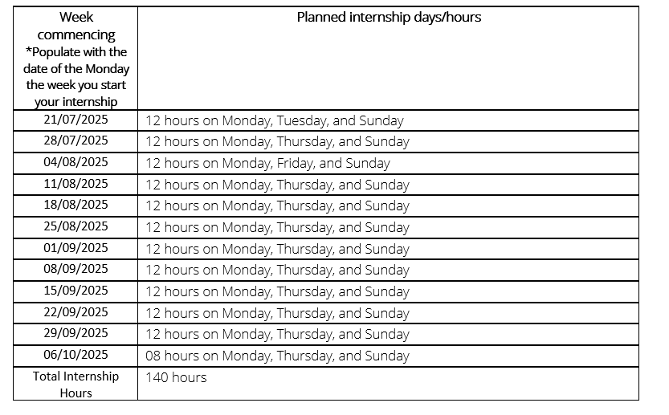
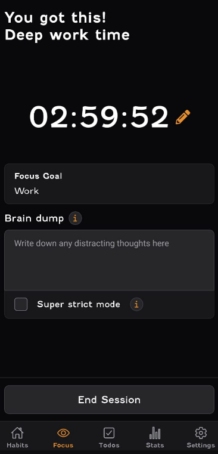

# Internship Time Plan

I have created a detailed time plan showing how I will easily meet the allocated time for this internship. This can be seen in the image below.

As shown, by following this plan I easily reach the allocated time by working 12 hours for the first 11 weeks and 8 hours in the last week thus working 140 hours for the duration of my internship. I will be working every Monday as I come in person and meet the rest of the team. And during the rest of the week I will be working on Thursday and during the weekend.

I try to start focus sessions on the Focus Bear App when I start working. I sometimes forget to start focus sessions but will make an effort to remember this.

