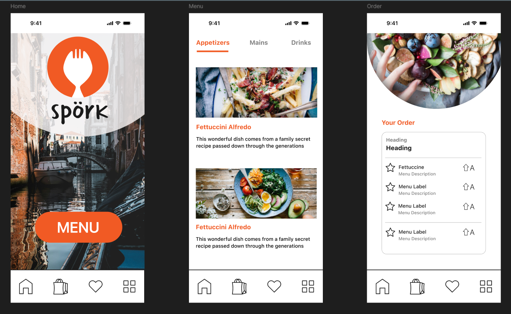

# Set your learning goals

## What do you hope to learn from this internship?
I hope to learn how professional software development companies work in teams, collaborate efficiently, and also learn Figma.

## What skills are you most excited to develop?
- Figma
- Teamwork
- Communication
- Time management

## What do you think you can contribute to the team?
I can contribute my knowledge in software development to help improve the App by making it more user-friendly, efficient and supportive to all types of users. I have been recently working on my final year group project in a team of 6 students with a real client, and we bonded really well by communicating freely, getting work done efficiently, and demonstrating great team building skills. I hope to bring a similar positive environment to the team I work with during this Internship. I also recently completed a LinkedIn course on getting started with Figma and end the product was like this:

- 

- This was the first time I ever used Figma and I was pretty proud of myself as the app looks really professional and would be ideal as a developer myself in terms of being able to develop a website while being able to look at a high fidelity prototype.

## What is one area you feel less confident in that you’d like to improve?
I am less confident in UX Designing because I haven't really done much UX designs especially in Figma so looking forward to learning it and being able to complete professional designs.

## What does success in this internship look like for you?
- Mastering Figma
- Being comfortable in a work environment
- Being confident in communication
- Being comfortable working in new environments
- Learning other miscellaneous skills