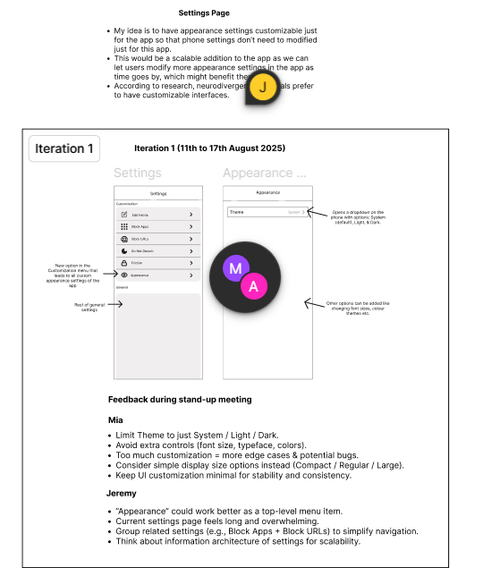
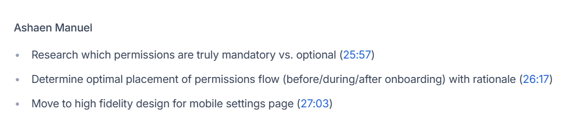

# Creating Low-Fidelity Wireframes

## What are low-fidelity wireframes, and why are they useful?

Low-fidelity wireframes are simple, basic sketches or digital layouts that focus on the overall structure and content placement of a screen or page without detailed visuals or styling.

They are useful because they:
- Are quick to create and modify, allowing fast exploration of ideas

- Help focus on layout, user flow, and functionality without distractions

- Enable early feedback from users and stakeholders on structure

- Support efficient collaboration across teams by communicating basic concepts clearly

- Reduce risk and cost by catching problems before investing in high-fidelity design

- Are ideal for brainstorming and validating concepts early in the design process

## How do low-fi wireframes help speed up the design process?

- Quick to create: Simple shapes and placeholders take much less time than detailed designs, allowing rapid sketching of ideas.

- Easy to modify: Changes can be made instantly without worrying about visual polish, enabling fast iteration.

- Focus on essentials: By concentrating on layout and flow rather than visuals, teams avoid getting bogged down in minor details early on.

- Facilitate faster feedback: Stakeholders and users can review and comment on structure quickly, helping identify issues before investing more time.

- Reduce costly rework: Catching usability and flow problems early prevents expensive fixes later in high-fidelity or development stages.

- Encourage collaboration: Low-fi wireframes are accessible to all team members, speeding up alignment and decision-making.

## What tools can be used for low-fi wireframing? (Figma, paper sketches, etc.)

- Paper and pencil/pen: Quick, flexible, and easy for brainstorming or sketching anywhere.

- Whiteboards: Great for collaborative sketching and group ideation sessions.

- Figma: Can be used with simple shapes and grayscale styles to create basic wireframes quickly.

- Balsamiq: Designed specifically for low-fi wireframes with hand-drawn style components.

- Sketch: Use basic shapes and gray tones for simple wireframes.

- Adobe XD: Supports creating low-fi wireframes with simple components and limited styling.

- Microsoft PowerPoint or Google Slides: Useful for quick wireframes using simple shapes and text boxes.

- Wireframe.cc: A minimalist online tool focused on very basic wireframing.

## How do UX teams use wireframes for early feedback and iteration?

- Share early concepts: Wireframes are shared with stakeholders, users, and team members to communicate the basic structure and flow of the product without distractions from visuals.

- Facilitate discussions: They provide a concrete reference for conversations about layout, navigation, and content priorities, helping align everyone’s understanding.

- Collect focused feedback: Since wireframes focus on functionality and flow, feedback centers on usability and structure rather than aesthetics.

- Conduct usability testing: Low-fidelity or clickable wireframes can be tested with users to observe task completion and identify pain points early.

- Iterate quickly: Because wireframes are easy to modify, UX teams can rapidly implement feedback, test new ideas, and refine the design multiple times.

- Prevent costly changes: Early iteration on wireframes reduces the risk of major redesigns during later, more expensive stages of high-fidelity design or development.

## How can low-fidelity wireframes help avoid costly design mistakes?

- Expose layout and flow problems early: Low-fi wireframes highlight confusing navigation, poor content organization, or missing elements without the distraction of visuals.

- Encourage quick iterations: They’re easy and cheap to change, so teams can test multiple solutions and find the best approach before committing resources.

- Focus feedback on usability: Stakeholders and users provide input on structure and function, not just aesthetics, helping catch real user experience issues.

- Reduce rework: Fixing issues at the wireframe stage is far less expensive and time-consuming than redoing high-fidelity designs or code.

- Clarify requirements: Wireframes help ensure everyone understands the intended functionality, lowering the chance of misunderstandings that cause costly changes later.

- Support early usability testing: Testing wireframes uncovers user pain points that, if left unresolved, would be more costly to address post-development.

## If a stakeholder wants to jump straight into high-fidelity design, how would you explain the value of low-fi wireframing?

1. Focus on the core structure first
- Low-fi wireframes let us nail down the layout, user flow, and functionality without distractions from colors, fonts, or branding. This ensures the foundation is solid before we invest in detailed visuals.

2. Save time and resources
- Creating and iterating on low-fi wireframes is much faster and cheaper than redesigning polished high-fidelity screens later. Fixing problems early avoids costly rework.

3. Get clearer, more useful feedback
- Stakeholders and users can focus on what really matters—how the product works and flows—rather than getting caught up in visual preferences.

4. Align the team early
- Wireframes provide a shared, simple reference for designers, developers, and product managers to agree on features and layout before moving forward.

5. Reduce risk
- Skipping this step increases the chance of missing usability issues or misunderstandings that become expensive and time-consuming to fix once high-fidelity designs or code are done.

## What are some common mistakes designers make when creating wireframes?

- Adding too much detail too early: Including colors, images, or fonts in wireframes can distract from focusing on layout and usability.

- Skipping wireframes altogether: Jumping straight into high-fidelity design without wireframing risks missing structural issues.

- Ignoring user goals and needs: Designing layouts without considering user tasks and flows leads to poor usability.

- Overcomplicating wireframes: Making wireframes too complex or dense can overwhelm stakeholders and hinder quick feedback.

- Not involving stakeholders early: Failing to share wireframes for feedback early reduces alignment and can cause late-stage changes.

- Neglecting mobile or responsive views: Designing only for desktop without wireframing other screen sizes can create usability problems later.

- Poor labeling or annotation: Lack of clear notes or explanations can confuse developers and other team members.

- Not iterating enough: Treating wireframes as final rather than evolving them through multiple feedback cycles can limit design quality.

## Task

Using the ux-usability-test-report, I decided to address the issue where the app lacks a setting option to change the theme of the app. Using research methods, I learnt that neurodivergent individuals prefer to have customisation options to the app and hence, I proposed a low-fi design that addresses this concern as shown in the below screenshot:

The founder included a comment saying it looks good but my supervisor suggested some changes. Hence, I redesigned an updated wireframe in the next iteration as shown below:

This time, the supervisor was happy and in our stand-up meeting, she asked me to start working on a high-fi prototype. The image below shows the AI's notes of our meeting:

This confirmed that the supervisor was happy with my work and that I can move on to a clickable high-fi prototype.

The link to my Figma design can be found here:
https://www.figma.com/design/Ao9BH0MbUsXtFwwOoEIvZX/Focus-Bear-App?node-id=0-1&t=FxAM7InDpLXCfMQR-1

