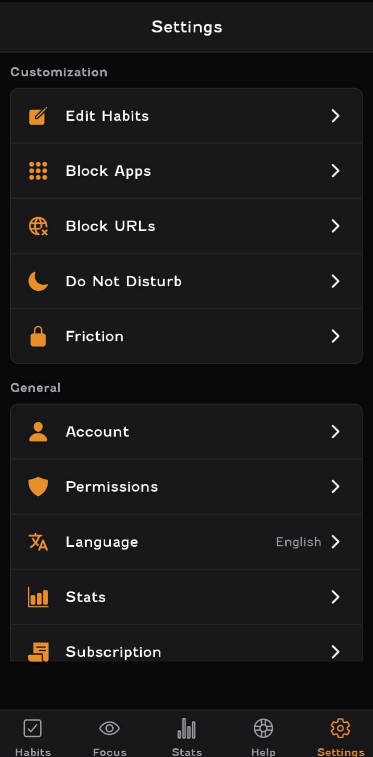

# Design Principles at Focus Bear

## What are Focus Bear’s design priorities?
- Simplicity
- Low-friction interactions
- Accessibility

## How should UI elements, colors, and typography support neurodivergent users?
- UI Elements
  - SImple, consistent layout
  - Clear, large buttons with enough spacing
  - Avoid unnecessary animations or flashing
- Colours
  - Use calm, consistent themes to reduce sensory overload
  - Ensure high contrast for readability
  - Avoid relying on colour alone to convey information
- Typography
  - Use clean fonts
  - Keep font sizes readable and adjustable
  - Use consistent hierachy and spacing for clarity

## Why does consistency in navigation & interaction patterns matter for usability?
- Helps users predict what will happen next, reducing confusion
- Builds muscle memory, speeding up task completion
- Reduces cognitive load by making the interface feel familiar
- Improves accessibility for users relying on assistive tech
- Supports confidence and independence in using the product

## How can small UI details (e.g., button placement, animations, tooltips) improve or harm usability?
Improves usability by:
- Placing buttons where users expect them for easy access
- Using subtle animations to provide feedback and guide attention
- Adding tooltips to clarify icons or actions

Harms usability by:
- Cluttering interfaces with too many buttons or confusing placement
- Using distracting or slow animations that delay tasks
- Relying on tooltips without alternative cues, confusing some users

## How can Focus Bear maintain a minimal, distraction-free UI while still offering powerful features?
1. Use progressive disclosure: show basic features upfront, hide advanced options until needed

- I identified that the Focus Bear App follows this principle well. The settings section is kept right at the end which allows customisation. The main features of the app (habits & focus mode) are kept at the start of the app and the first 2 options in the bottom navigation bar. This principle can be observed in the screenshot below.

- 

- I found that this is a very good UI and UX feature of the app.

2. Keep the interface clean with lots of whitespace and simple visuals
3. Use icons with clear labels to reduce text clutter
4.  Allow customization so users can enable/disable features based on preference
5. Focus on core tasks first, avoiding unnecessary extras

## If a design change improves aesthetics but reduces usability, how should UX handle it?
- Prioritize usability over aesthetics. User needs come first
- Discuss trade-offs openly with the team
- Suggest compromises that balance beauty and function
- Use user testing to gather real feedback before finalizing
- Iterate to improve both usability and visual appeal over time

## What are the risks of overloading users with too many choices or settings?
- Causes decision fatigue leading to frustration or avoidance
- Increases cognitive load, making tasks harder to complete
- Can overwhelm users, especially those with ADHD or Autism
- Leads to mistakes or incorrect settings
- Reduces overall user satisfaction and engagement
- Makes onboarding and learning the app more difficult