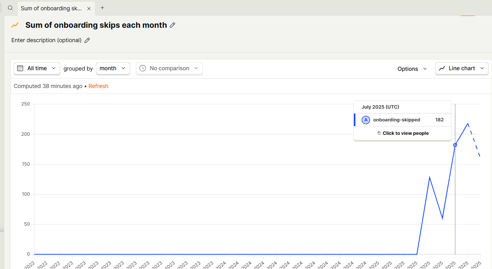

# How to Use UX Metrics to Measure Success

## What are key UX metrics used to measure usability and engagement?
- **Task completion rate:** % of users successfully completing key tasks.  
- **Time on task:** How long it takes to complete actions.  
- **Error rate:** Frequency of mistakes or misclicks.  
- **Retention/return rate:** How often users come back.  
- **Feature usage:** Which features are most/least used.  
- **User satisfaction (CSAT/NPS):** Surveys for overall experience.  

## What is the difference between quantitative (e.g., task completion rate) and qualitative (e.g., user sentiment) metrics?
- **Quantitative:** Numbers and stats (task success, clicks, retention).  
- **Qualitative:** User opinions, feedback, sentiment, observations from usability tests.  
- **Use together:** Numbers tell “what” is happening, qualitative explains “why.”  

## How do tools like heatmaps, session recordings, and analytics dashboards help track UX performance?
- **Heatmaps:** Visualize where users click or scroll most.  
- **Session recordings:** Observe real user interactions, identify pain points.  
- **Analytics dashboards (Google Analytics, Mixpanel):** Track engagement trends and funnels.  
- **Surveys & feedback widgets:** Capture user sentiment and suggestions. 

## How can designers use A/B testing data to validate improvements?
- Compare two versions of a design to see which performs better.  
- Test small changes (button placement, copy, onboarding flow).  
- Use metrics like click-through, task completion, or retention to measure impact.  
- Iterate based on statistically significant results. 

## If a UX metric shows poor user engagement, how would you determine the cause?
- Check user flows to identify friction points.  
- Observe session recordings or conduct usability tests.  
- Gather qualitative feedback to understand pain points.  
- Prioritize fixes that address the biggest barriers first. 

## What are the risks of relying too much on numbers instead of qualitative feedback?
- Can miss context or emotional experience of users.  
- Metrics may mislead if sample size is small or skewed.  
- Numbers alone can overlook rare but critical usability issues. 

## How can UX designers use metrics to convince stakeholders to invest in usability improvements?
- Present clear before-and-after comparisons.  
- Link usability improvements to business outcomes (retention, conversions, satisfaction).  
- Use a mix of qualitative and quantitative evidence for compelling storytelling.  
- Highlight cost/benefit of fixing key UX issues.  

## Task

A key metric I decided to investigate was the sum of users who skipped the onboarding carousel each month.

### Observations

The following is the data I retrieved:

- May-25: onboarding skips start appearing (128).
- Jun-25: drops to 60 → could indicate a temporary fix, fewer new users, or reporting lag.
- Jul-25 to Aug-25: sharp increase (182 to 218) to onboarding friction likely increased or more users trying the app.
- Sep-25: slight decrease to 159 which could indicate stabilization or users adapting.

The screenshot below shows the graph of Posthog with this data:

Overall, skips are consistently high compared to pre-May-25, indicating a new friction point.

### Possible causes:
- New app version or onboarding flow changes introduced around May-25.
- Permission requests (notifications, screen time) may frustrate users.
- Lengthy onboarding steps or confusing goal/habit setup.
- Casual users experimenting with the app and skipping steps.

### Improvement: Simplify and guide the onboarding flow
- Highlight immediate value: let users experience one key feature (e.g. focus session) before asking for goals or permissions.
- Break large steps into smaller, actionable chunks rather than multiple input screens at once.
- Clarify permissions: make notification and screen-time requests contextual, explaining why they matter right when the user will use the feature.
- Add micro-feedback/progress indicators to show users how far they’ve come and what’s left.

### Expected impact
- Reduce onboarding skips by lowering cognitive load.
- Increase engagement by giving users an early success experience.
- Improve first-session completion and adoption of key features.

I spoke with one of the developers to understand how the onboarding-skipped metric is tracked in PostHog. They explained that the metric counts users who trigger the onboarding_started event but never reach onboarding_completed during their first session. We discussed how various events are created and set in various instances of the code so that metrics can be calculated.