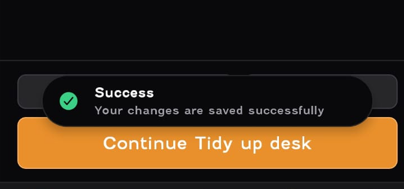

# UX Usability Test Report

## Scenario

I got my friend to set up a focus session on the Focus Bear App on his Iphone.

## Bugs

### Priority: High

1. App timed out when logging in without an account

- User’s experience: When my friend clicked “Continue without an account,” the app timed out. It only worked after he clicked it a second time.

- Why this matters: A login failure on the first attempt can create doubt about whether the app is reliable, especially for new users.

- My thoughts: This is critical because many users try apps without signing up, and a poor first impression might lead them to abandon it.

2. Super Strict Mode allowed ending a session early

- User’s experience: Despite the label saying “you cannot turn off focusing mode until the timer finishes,” tapping “Super Strict Mode” still allowed him to end the timer.

- Why this matters: The feature contradicts user expectations. A mode meant to enforce discipline should function exactly as described.

- My thoughts: Fixing this would improve trust in the app, as users rely on “Super Strict Mode” for accountability.

## Thoughts

### Priority: High

1. Felt like having too much things to set up during onboarding and clicked "Do it later".

- User’s experience: Since all he wanted to do was a focus session, he felt that a lot of the induction content was unnecessary for him.

- Why this matters: This is important because a lot of users may feel as if the app has too much information shown to them at the start itself that may make them confused and lead them to uninstalling the app.

- My thoughts: Offering a “Quick Start” mode for first-time users could improve adoption. Advanced features can be introduced gradually. Or at the start itself let the choose whether they want to learn a specific thing or simply skip everything.

2. Wants to see the list of habits in the screen when successfully adding habits. Habits screen doesn't show the habits just added.

- User’s experience: He wanted to see newly added habits immediately, but they didn’t appear on the Habits screen.

- Why this matters: Feedback is critical. Without immediate confirmation, users may think their input wasn’t saved.

- My thoughts: I believe the reason he didn't see the added habit was because he added the habit to his evening routine while the time was in the morning so on the habits page, the app only showed the morning routine habits.Showing added habits instantly in the form a success message would be ideal. Currently the success message once a habit is added is like below:

- This is not ideal as the message is very general and can be modified to "Successfully added habit - Take Medicine, to your evening routine".

### Priority: Medium

3. Unsure what clicking a task does with the timer. and what clicking back means.

- User’s experience: He was unsure what clicking a task does in relation to the timer, and what going back while the timer is running means during a session.

- Why this matters: Unclear interactions can create hesitation and reduce efficiency.

- My thoughts: Tooltips or visual cues could clarify how tasks integrate with timers.

### Priority: Low

4. Confusion about distraction blocking permissions

- User’s experience: He wasn’t sure what granting permission for distraction blocking does.

- Why this matters: Users may hesitate to grant permissions if they don’t understand the purpose, which can prevent the feature from working as intended.

- My thoughts: A simple tooltip or short explanation (“This allows Focus Bear to block distracting apps during sessions”) could address this concern.

5. Not sure why does the app need his screen time

- User’s experience: He wasn’t sure what benefit he gets by granting his screen time 

- Why this matters: Similar to the first thought, users may hesitate to grant permissions if they don’t understand the purpose, which can prevent certain features of app functioning.

- My thoughts: A simple tooltip or short explanation (“This allows Focus Bear to show you how productive your screen time was”) could address this concern.

6. Needs a bit more colour, not having just two colours (White & Orange) maybe have more colours.

- User’s experience: He thought the app needed “a bit more colour” beyond just black, white and orange. Maybe because he wasn't comfortable with the dark theme.

- Why this matters: Visual design affects perceived quality and engagement.

- My thoughts: Introducing a broader but consistent palette could make the app feel more polished.

7. It should also have an option to switch between light & dark themes on the app itself (didn't like the dark themed mode of the app). Felt that white background might be more comfortable.

- User’s experience: He disliked the dark theme (which was the theme of his phone), and didn't want to switch his phone theme to light mode just for this app.

- Why this matters: Giving users control over appearance increases comfort and accessibility.

- My thoughts: Adding a theme toggle would be a relatively simple but impactful improvement. An option under the customization section of the settings page can have the option to toggle between themes just for this app. This is a scalable option too as it allows integration of more additional appearance modifications such as font, font size etc.

8. Whitespace when scrolling up in the Get Motivation page is annoying to see.

- User’s experience: Extra whitespace when scrolling felt awkward.

- Why this matters: While minor, poor spacing can make an interface feel less polished.

- My thoughts: Adjusting layout margins would improve visual flow.

## Questions after setting up a focus session

1. What was easy or intuitive about the process?

- "If I wanted to just set up a focus session, the habits part are unnecessary. The big numbers to set up the timers are easy, so other than that everything was easy and intuitive."

- My thoughts - The app's onboarding involves adding habits, routines, and focus sessions, and the app's first screen is the habits page. Because of this, he might have felt like he had a lot of unnecessary information shown to him since he simply wanted to set up a focus session only.

2. Was anything confusing, frustrating, or unexpected?

- "The bug in the super strict mode was unexpected."

- My thoughts - This is high priority bug as it contradicts what the app says and causes to lose trust in the app's features. Hence, this issue must be fixed as soon as possible.

3. Did you find all the features you expected?

- "Yes, could have had the apps I wanted to block off in the app itself at the bottom before the "Start Focusing" button to block apps without having to go to settings."

- My thoughts - This is an interesting feature that can be integrated. Maybe for certain focus sessions the user may want to block off different apps so could be useful to add in the future.

4. If you could change one thing about this setup 
experience, what would it be?

- "Having the light and dark themed modes. Edit habits in ths settings section could be in the bottom navigation bar with the same theme without taking to whole new page."

- My thoughts - As mentioned before, for the light and dark themed modes, a separate appearance option can be added to the settings page letting users to modify the theme of the app. In the habits page, there could be an option that takes the user to the same page it takes the user when they click the edit habits section in the settings page. And when going to this page, it feels like the app is taking the user to an external page because of the loading screen and a bit different UI which can be confusing. This screen can maybe be simplified so that it stay consistent with the structure of the rest of the app.

5. Would you feel confident using this app regularly? Why or why not?

- "Not as regularly as there is no Edit habit section in the habits page of the bottom navigation bar, maybe for research to focus plainly, yes I would use."

- My thoughts - This could be because the user feels like the app has too many steps to add habits to the routine. Hence why he wouldn't want to use the app regularly unless it involves simple focus sessions.

## Conclusion

My friend raised several valuable points that could help improve the app. Some issues could be addressed by providing clearer messages after certain actions, while others might naturally resolve as users become more familiar with the app over time.

## Reflection

1. What surprised you the most about how your test participant used the app?

- I was suprised by the quality of the issues he raised while navigating through the app. I feel like they were really useful as there were some serious bugs that should be addressed.

2. Did they encounter any issues that you didn’t expect?

- Yes, I didn't expect encountering both the 2 bugs I mentioned.

3. How could this test improve your approach to UX design?

- This test showed me the importance of designing for users who want to get started quickly without going through full onboarding. It also highlighted how critical it is to explain permissions and features clearly, as confusion around Screen Time and distraction blocking reduced trust in the app. Going forward, I’d focus more on testing early prototypes with real users to catch these pain points sooner and prioritize clarity and flexibility in the design.