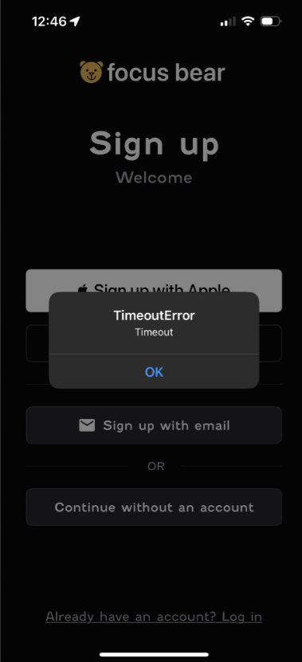
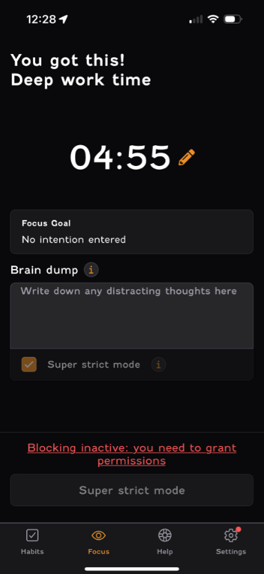

# UX Usability Test Report

## Scenario

I got my friend to set up a focus session on the Focus Bear App on his Iphone.

## Bugs

1. The app timed out when trying to login without an account (When clicking continue without an account). Worked the second time he clicked it

2. Super strict mode says that I cannot turn off focusing mode until timer finises but when clicking "Super strict mode", it let me end timer.

## Thoughts

1. Wasn't sure what setting up permission for distraction blocking does.

2. Not sure why does the app need his screen time

3. Felt like having too much things to set up during onboarding and clicked "Do it later".

4. Needs a bit more colour, not having just two colours (White & Orange) maybe have more colours. 

5. It should also have an option to switch between light & dark themes on the app itself (didn't like the dark themed mode of the app). Felt that white background might be more comfortable.

6. Unsure what clicking a task does with the timer. and what clicking back means.

7. Whitespace when scrolling up in the Get Motivation page is annoying to see.

8. Want the list of habits in the screen when I add the habits. Habits screen doesn't show the habits I added.

## Questions after setting up a focus session

1. What was easy or intuitive about the process?

- "If I wanted to just set up a focus session, the habits part are unnecessary. The big numbers to set up the timers are easy, so other than that everything was easy and intuitive."

2. Was anything confusing, frustrating, or unexpected?

- "The bug in the super strict mode was unexpected."

3. Did you find all the features you expected?

- "Yes, could have had the apps I wanted to block off in the app itself at the bottom before the "Start Focusing" button to block apps without having to go to settings."

4. If you could change one thing about this setup 
experience, what would it be?

- "Having the light and dark themed modes. Edit habits in ths settings section could be in the bottom navigation bar with the same theme without taking to whole new page."

5. Would you feel confident using this app regularly? Why or why not?

- "Not as regularly as there is no habits section in the bottom navigation bar, maybe for research to focus plainly, yes I would use."

## My thoughts

My friend raised several valuable points that could help improve the app. Some issues could be addressed by providing clearer messages after certain actions, while others might naturally resolve as users become more familiar with the app over time.

## Reflection

1. What surprised you the most about how your test participant used the app?

- I was suprised by the quality of the issues he raised while navigating through the app. I feel like they were really useful as there were some serious bugs that should be addressed.

2. Did they encounter any issues that you didn’t expect?

- Yes, I didn't expect encountering both the 2 bugs I mentioned.

3. How could this test improve your approach to UX design?

- This test showed me the importance of designing for users who want to get started quickly without going through full onboarding. It also highlighted how critical it is to explain permissions and features clearly, as confusion around Screen Time and distraction blocking reduced trust in the app. Going forward, I’d focus more on testing early prototypes with real users to catch these pain points sooner and prioritize clarity and flexibility in the design.